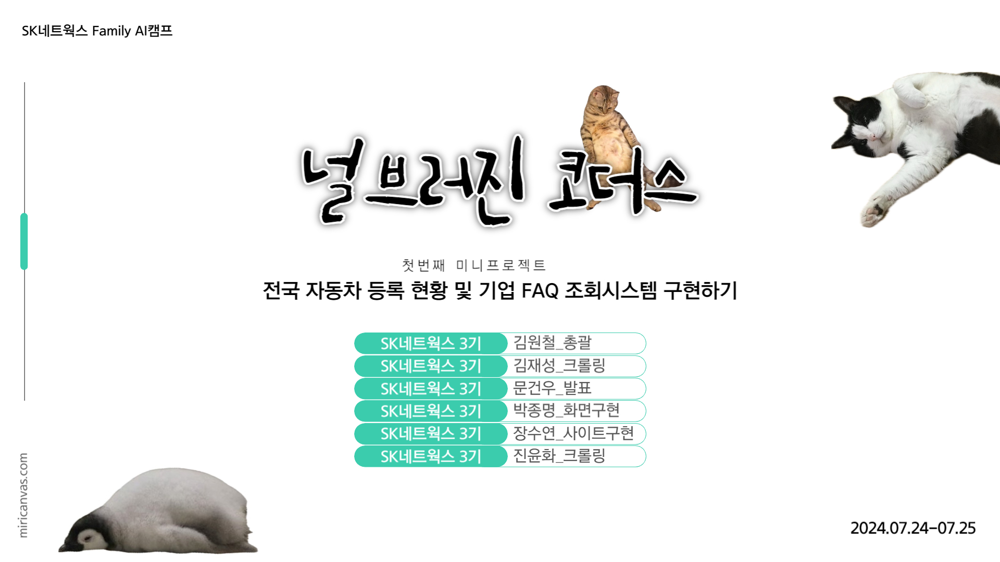
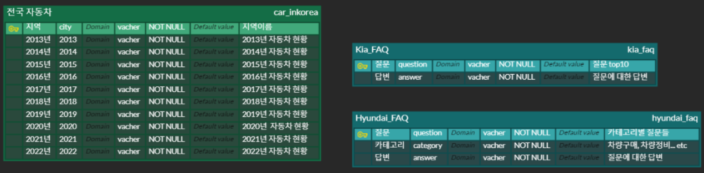
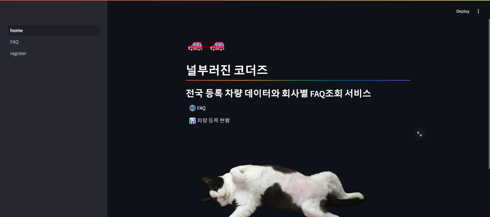
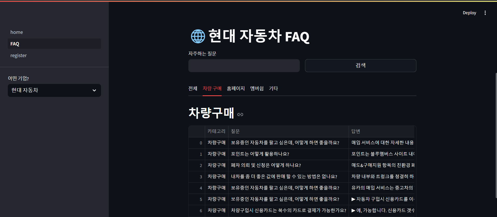
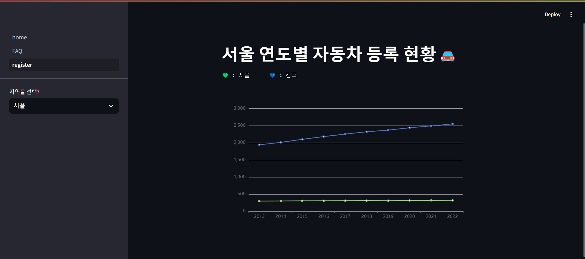

## SKN03-1st-6Team #null브러진 코더즈

# 프로젝트 소개

국내 자동차 등록 현황 및 자동차 제조사 고객 FAQ를 조회할 수 있는 사이트를 구현했습니다. 자동차 등록 현황은 전국 데이터를 포함하여 **연도별 차량 등록 현황을 선탁한 지역으로 조회할 수 있게 설계했고, 고객 FAQ 조회는 **브랜드별로 선택하고 사용자가 원하는 단어를 포함한 질문과 답변을 조회할 수 있게 설계했습니다.****

# 기술 스택

# ERD 구성

# 화면 구성

메인 페이지 화면

---

FAQ 페이지 화면

---

등록 차량 조회 페이지

